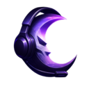

# 🌙 MoonMic - Voice Chat for Memecoins

A Chrome extension that enables real-time voice chat on memecoin pages across Axiom and BullX platforms.



## ✨ Features

- 🎤 **Real-time Voice Chat** - WebRTC peer-to-peer audio communication
- 🎯 **Smart Detection** - Automatically detects memecoin pages on Axiom and BullX
- 🏠 **Room Management** - Users on the same token join the same voice chat room
- 🎨 **Beautiful UI** - Dark purple theme with modern design
- 🔇 **Mute/Unmute** - Full audio control during voice sessions
- 📱 **Responsive Design** - Works on all screen sizes
- 🚀 **Production Ready** - Complete server infrastructure included

## 🎯 Supported Platforms

- **Axiom** - Detects `/meme/` and `/token/` pages
- **BullX** - Detects `/terminal?chainId=` with `address=` parameter

## 🚀 Quick Start

### 1. Install the Extension
```bash
# Clone the repository
git clone https://github.com/MoonMic/MoonMic.git
cd MoonMic

# Set up icons (optional)
./icon_setup.sh

# Load in Chrome:
# 1. Go to chrome://extensions/
# 2. Enable "Developer mode"
# 3. Click "Load unpacked"
# 4. Select the MoonMic folder
```

### 2. Deploy Voice Chat Server
Choose your preferred hosting platform:

#### Railway (Recommended - 5 minutes)
```bash
# Follow the Railway setup guide
./prepare-railway.sh
# Then visit: https://railway.app
```

#### Glitch (Always Free - 2 minutes)
```bash
# Follow the Glitch setup guide
./prepare-glitch.sh
# Then visit: https://glitch.com
```

### 3. Update Extension
In `content.js`, set your server URL:
```javascript
const PRODUCTION_SERVER_URL = 'wss://your-server-url.com';
```

### 4. Test Voice Chat
1. Navigate to a memecoin page on Axiom or BullX
2. Click the MoonMic extension icon
3. Click "Join Voice Chat"
4. Enter your username and connect!

## 🏗️ Architecture

### Frontend (Chrome Extension)
- **Manifest V3** - Modern Chrome extension architecture
- **Content Scripts** - Injects overlay into webpages
- **WebRTC** - Peer-to-peer audio communication
- **WebSocket** - Signaling server communication

### Backend (Voice Chat Server)
- **Node.js** - Server runtime
- **WebSocket** - Real-time signaling
- **Express** - HTTP server with health checks
- **Security** - CORS, Helmet.js, input validation

## 📁 Project Structure

```
MoonMic/
├── 📱 Extension Files
│   ├── manifest.json          # Extension configuration
│   ├── content.js             # Main overlay and voice chat logic
│   ├── background.js          # Background script
│   ├── popup.html/js/css      # Extension popup
│   ├── overlay.css            # Overlay styling
│   └── icons/                 # Extension icons
├── 🖥️ Server Files
│   ├── server/package.json    # Server dependencies
│   ├── server/server.js       # Voice chat signaling server
│   └── server/env.example     # Environment variables template
├── 📚 Documentation
│   ├── DEPLOYMENT.md          # Complete deployment guide
│   ├── RAILWAY_SETUP.md       # Railway-specific setup
│   ├── FREE_DEPLOYMENT.md     # Free hosting options
│   └── ICON_SETUP.md          # Icon setup instructions
└── 🛠️ Scripts
    ├── deploy.sh              # Deployment helper
    ├── prepare-railway.sh     # Railway preparation
    ├── prepare-glitch.sh      # Glitch preparation
    └── test-local.sh          # Local testing
```

## 🎨 Customization

### Colors
The extension uses a dark purple theme:
- Background: `#2C004F`
- Button: `#5F1A9B`
- Button Hover: `#7B2BC7`
- Active Button: `#E74C3C`

### Styling
- **Fonts**: Orbitron, Audiowide, Russo One
- **Effects**: Backdrop blur, transparency, shadows
- **Layout**: Flexbox, responsive design

## 🚀 Deployment Options

### Free Hosting
| Platform | Setup Time | Free Limits | Sleep | Best For |
|----------|------------|-------------|-------|----------|
| **Railway** | 5 min | 500 hours/month | No | Production |
| **Glitch** | 2 min | Unlimited | Yes | Testing |
| **Render** | 10 min | 750 hours/month | Yes | Development |

### Production Hosting
- **Railway** - $5/month for unlimited
- **DigitalOcean** - $7/month for always-on
- **Heroku** - $7/month for hobby tier

## 🧪 Testing

### Local Testing
```bash
# Test server locally
./test-local.sh

# Test WebSocket connection
node test-server.js
```

### Production Testing
```bash
# Health check
curl https://your-server.com/health

# WebSocket test (browser console)
const ws = new WebSocket('wss://your-server.com');
ws.onopen = () => console.log('✅ Connected!');
```

## 🔧 Development

### Prerequisites
- Node.js 16+
- Chrome browser
- ImageMagick (for icon setup)

### Local Development
```bash
# Install server dependencies
cd server && npm install

# Start local server
npm start

# Test extension with local server
# Change SERVER_URL to LOCAL_SERVER_URL in content.js
```

### Building
```bash
# Set up icons
./icon_setup.sh

# Test locally
./test-local.sh

# Deploy to hosting platform
./prepare-railway.sh  # or prepare-glitch.sh
```

## 📊 Performance

### Voice Chat
- **Latency**: <100ms typical
- **Quality**: High-quality audio
- **Concurrent Users**: 10+ per room
- **Bandwidth**: ~50kbps per user

### Extension
- **Load Time**: <1 second
- **Memory Usage**: <10MB
- **CPU Usage**: Minimal
- **Battery Impact**: Low

## 🔒 Security

- **CORS** - Configured for Axiom and BullX
- **Input Validation** - All user inputs sanitized
- **WebRTC** - Peer-to-peer encryption
- **HTTPS/WSS** - Secure connections only
- **Helmet.js** - Security headers

## 🤝 Contributing

1. Fork the repository
2. Create a feature branch
3. Make your changes
4. Test thoroughly
5. Submit a pull request

## 📄 License

This project is open source and available under the MIT License.

## 🆘 Support

### Common Issues
- **Connection Failed**: Check server URL and CORS settings
- **No Audio**: Verify microphone permissions and WebRTC
- **Users Not Joining**: Check room ID generation and URL detection

### Getting Help
- Check the deployment guides in `/docs`
- Test with the provided scripts
- Monitor server logs for errors
- Verify extension console for connection issues

## 🌟 Roadmap

- [ ] Mobile app version
- [ ] Video chat support
- [ ] Screen sharing
- [ ] Custom themes
- [ ] User profiles
- [ ] Chat history
- [ ] Push notifications

---

**Made with ❤️ for the memecoin community**

## Features

- 🎤 Simple microphone activation interface
- 🎨 Beautiful dark purple theme
- 📱 Responsive popup design
- 🎧 Interactive headphone icon
- 📊 User count display
- ⤢ Expand functionality (ready for implementation)

## Installation

### Extension Setup
1. **Download or clone this repository**
   ```bash
   git clone <repository-url>
   cd MoonMic
   ```

2. **Set up the icons (optional)**
   ```bash
   ./icon_setup.sh
   ```
   This will regenerate the PNG icons from the SVG source. Requires ImageMagick to be installed.

3. **Open Chrome and navigate to Extensions**
   - Open Chrome browser
   - Go to `chrome://extensions/`
   - Enable "Developer mode" (toggle in top right)

4. **Load the extension**
   - Click "Load unpacked"
   - Select the `MoonMic` folder
   - The extension should now appear in your extensions list

5. **Access the extension**
   - Click the MoonMic icon in your Chrome toolbar
   - The popup will appear with the beautiful dark purple interface

### Voice Chat Server Setup
For full voice chat functionality, you need to deploy the signaling server:

1. **Quick Setup**: Run `./deploy.sh` for guided deployment
2. **Manual Setup**: See `DEPLOYMENT.md` for detailed instructions
3. **Update Extension**: Set your server URL in `content.js`

**Recommended Platforms:**
- Railway (easiest): https://railway.app
- Render: https://render.com
- Heroku: https://heroku.com
- DigitalOcean: https://cloud.digitalocean.com/apps

## Usage

- **Start Mic**: Click the "Start Mic" button to activate microphone functionality
- **Stop Mic**: Click "Stop Mic" to deactivate
- **Headphone Icon**: Click for visual feedback
- **Expand Icon**: Click to expand (functionality can be implemented)
- **Title**: Shows as draggable (functionality can be implemented)

## File Structure

```
MoonMic/
├── manifest.json      # Extension configuration
├── popup.html         # Main popup interface
├── popup.css          # Styling and theme
├── popup.js           # JavaScript functionality
├── icons/             # Extension icons (16px, 48px, 128px)
│   ├── icon.svg       # Source SVG icon
│   ├── icon16.png     # 16x16 icon
│   ├── icon48.png     # 48x48 icon
│   └── icon128.png    # 128x128 icon
└── README.md          # This file
```

## Customization

### Colors
The extension uses a dark purple theme:
- Background: `#2C004F`
- Button: `#5F1A9B`
- Button Hover: `#7B2BC7`
- Active Button: `#E74C3C`

### Features to Add
- Actual microphone functionality using `navigator.mediaDevices.getUserMedia()`
- Real-time voice chat capabilities
- User authentication
- Expand to full window functionality
- Draggable popup interface

## Development

To modify the extension:
1. Edit the files in the `MoonMic` directory
2. Go to `chrome://extensions/`
3. Click the refresh icon on the MoonMic extension
4. Test your changes

## Browser Compatibility

- Chrome 88+ (Manifest V3)
- Other Chromium-based browsers (Edge, Brave, etc.)

## License

This project is open source and available under the MIT License. 